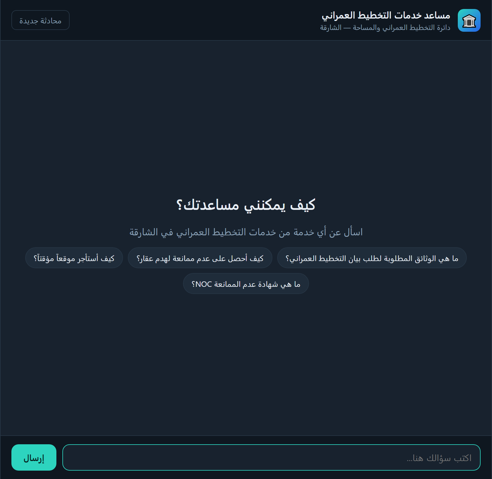
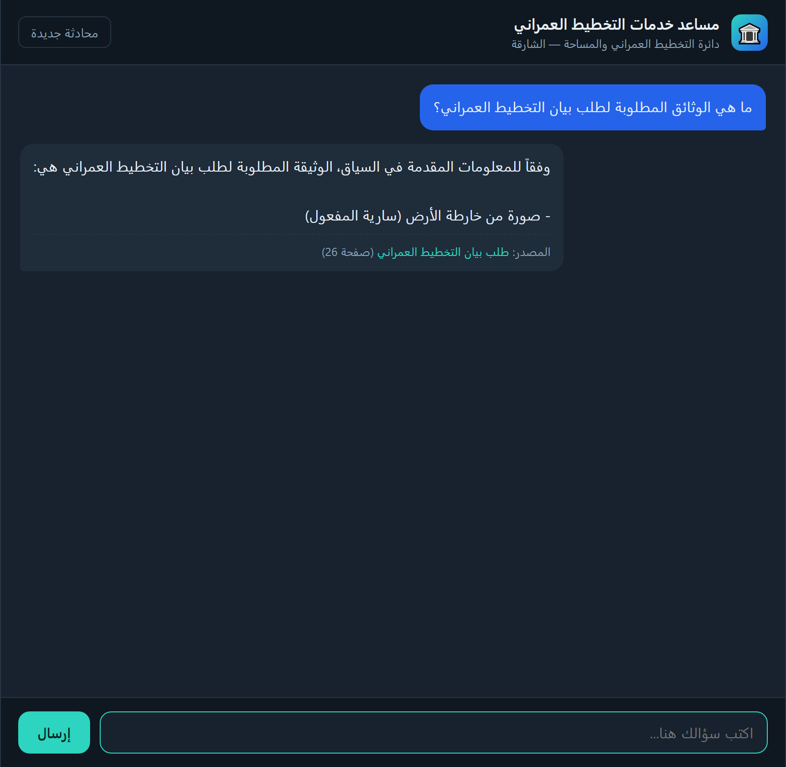

# 🏛️ SDTPS — Arabic Q&A RAG Chatbot


-orange)


A **fully-local, Arabic-language** Retrieval-Augmented-Generation chatbot that answers
questions about **Sharjah Directorate of Town Planning & Survey (SDTPS)** services,
grounded in an official 43-page Arabic (right-to-left) services catalogue.

Everything runs on your own machine — **no cloud APIs and no API keys**. Embeddings use
**BGE-M3** on the GPU; answer generation uses a local **Ollama** model.

## Highlights

- **RTL-correct PDF extraction** — reconstructs Arabic reading order from PyMuPDF word
  boxes (naïve PDF loaders scramble right-to-left text).
- **Table-aware chunking** — one chunk per service, with the service's fields parsed into
  metadata instead of being shredded by fixed-size splitting.
- **Hybrid retrieval** — dense (BGE-M3) + sparse (BM25 over light-stemmed Arabic) +
  fuzzy service-name detection, fused with Reciprocal Rank Fusion.
- **Multi-turn memory** — elliptical follow-ups ("وكم رسومها؟") are rewritten into
  standalone questions before retrieval.
- **Evaluation harness** — offline retrieval metrics (Hit@k, MRR, Recall@k) plus RAGAS
  answer-quality metrics.
- **Web API + chat simulator** — a FastAPI service and a single-page Arabic RTL chat UI.
- **Semantic answer cache** — repeated/near-identical questions are served from an in-process
  embedding cache, skipping retrieval + the LLM.
- **Dockerized & CI/CD** — `docker compose up` runs the app + Ollama with persistent caches;
  GitHub Actions lints, tests, and publishes the image to GHCR.

## Key design decisions

| Concern | Approach |
|---|---|
| RTL extraction | PyMuPDF word-boxes + custom reading-order reconstruction (`rag/extract.py`) |
| Table/form structure | one chunk per service, fields → metadata (`rag/parse.py`, `rag/chunk.py`) |
| Service-name filtering | fuzzy service detection fused into retrieval (`rag/retriever.py`) |
| Hybrid retrieval | dense + sparse + service filter, combined with RRF (`rag/retriever.py`) |
| Arabic lexical matching | normalization + light stemming for BM25 (`rag/arabic.py`) |
| Multi-turn chat | history-aware query rewriting (`rag/memory.py`) |
| No vector DB | ~43 docs ⇒ numpy cosine + in-memory BM25 — fast, dependency-light |

## Architecture

```
PDF ──extract(RTL)──▶ pages ──parse(labels)──▶ services.jsonl
                                                   │
                                          chunk (1 per service)
                                                   │
                       ┌───────────────────────────┴───────────────┐
                       ▼                                            ▼
              BGE-M3 embeddings (GPU)                     BM25 (Arabic-normalized)
                       │                                            │
                       └──────────────┬─────────────────────────────┘
                                      ▼
                 HybridRetriever:  service-name filter + dense + sparse  → RRF
                                      ▼
              context ──▶ Ollama LLM (grounded Arabic prompt) ──▶ answer + source
                                      ▲
                              ConversationMemory (rewrites follow-ups)
```

## Setup

1. **Python deps** (Python 3.14 + an NVIDIA GPU recommended):
   ```bash
   python -m pip install -r requirements.txt
   ```
   Install the CUDA build of `torch` from <https://pytorch.org> for GPU embeddings.

2. **Ollama model** — install [Ollama](https://ollama.com) and pull an Arabic-capable
   instruct model:
   ```bash
   ollama pull qwen2.5:7b
   ```

3. **Config (optional)** — copy `.env.example` to `.env` to override models or retrieval
   settings; the defaults work out of the box.

## Usage

```bash
python cli.py index                              # build the search index from the PDF
python cli.py ask "ما هي الوثائق المطلوبة لطلب بيان التخطيط العمراني؟"
python cli.py chat                               # interactive multi-turn chat
python cli.py eval                               # retrieval metrics (Hit@k, MRR, Recall@k)
python cli.py eval --ragas --n 5                 # + RAGAS answer-quality metrics
python cli.py serve                              # web API + chat simulator
```

### Demo

Run `python cli.py serve` and open <http://127.0.0.1:8000> to chat with the bot in a
browser (Arabic RTL UI, source citations, multi-turn memory).

| Welcome screen | Grounded answer with source |
|:---:|:---:|
|  |  |

### Web API

`python cli.py serve` starts a FastAPI app that loads the models once and serves:

| Route | Method | Body | Returns |
|---|---|---|---|
| `/` | GET | — | the chat simulator (HTML) |
| `/chat` | POST | `{message, session_id?}` | `{session_id, answer, query_used, sources[]}` |
| `/reset` | POST | `{session_id}` | clears that conversation's memory |
| `/health` | GET | — | model + index status |

Conversation memory is kept per `session_id` (returned by the first `/chat` call). When an
answer is served from the semantic cache the response carries `"cached": true`.

## Run with Docker

```bash
docker compose up --build          # starts the app + an Ollama container
# add the GPU override to run the LLM on an NVIDIA GPU:
docker compose -f docker-compose.yml -f docker-compose.gpu.yml up --build
```

On first start the app container waits for Ollama, **auto-pulls** `OLLAMA_MODEL`, builds the
index, then serves on <http://localhost:8000>. The model pull and index build only happen once —
see *Caching* below. A prebuilt image is published to GHCR:

```bash
docker pull ghcr.io/ziadt160/sdtps-rag-chatbot:latest
```

## Caching

Three layers keep startup and queries fast:

| Layer | What it caches | Where |
|---|---|---|
| **Model weights** | BGE-M3 embedding weights | `hf_cache` volume (`HF_HOME`) |
| **Built index** | embeddings + chunks (no re-parse/re-embed) | `index_data` volume (`data/index/`) |
| **Ollama models** | pulled LLMs (e.g. qwen2.5:7b) | `ollama_models` volume |
| **Answers** | semantic answer cache for repeated questions | in-process (`rag/cache.py`) |

The first three survive `docker compose down` (named volumes), so restarts are instant. The
answer cache embeds each standalone query and returns a stored answer when cosine similarity
≥ `CACHE_SIM_THRESHOLD`, avoiding a redundant retrieval + LLM call. CI additionally uses
GitHub Actions build-layer caching (`type=gha`) for fast image builds.

## Project layout

```
rag/        core package (extract, parse, chunk, arabic, embeddings, index,
            retriever, llm, memory, cache, pipeline)
api/        FastAPI app (app.py) + chat simulator (web/index.html)
eval/       golden.jsonl + retrieval_eval.py + ragas_eval.py
tests/      pytest unit tests (arabic, parse, chunk, RRF, cache)
docker/     container entrypoint (wait-for-Ollama → pull → index → serve)
data/       SDTPSPublicInformation.pdf  (services.jsonl + index/ generated by `cli.py index`)
cli.py      command-line entry point (index / ask / chat / eval / serve)
Dockerfile  docker-compose.yml  .github/workflows/ci.yml
```

```
rag/        core package (extract, parse, chunk, arabic, embeddings,
            index, retriever, llm, memory, pipeline)
api/        FastAPI app (app.py) + chat simulator (web/index.html)
eval/       golden.jsonl + retrieval_eval.py + ragas_eval.py
data/       SDTPSPublicInformation.pdf  (services.jsonl + index/ generated by `cli.py index`)
cli.py      command-line entry point (index / ask / chat / eval / serve)
```

## Results (25-question golden set)

| Retrieval | @1 | @3 | @5 | MRR |
|---|---|---|---|---|
| Hit | 0.88 | **1.00** | **1.00** | **0.94** |
| Recall | 0.84 | 1.00 | 1.00 | |

RAGAS (n=3): faithfulness **0.77**, answer relevancy **0.95**, context precision **0.90**.
The chatbot is fully local; only the optional RAGAS *judge* (`RAGAS_JUDGE_MODEL`) may use a
stronger model, since a small local judge is slow/weak for RAGAS.

## Notes & limitations

- A few PDF pages have irregular layouts; field parsing is heuristic, but every chunk keeps
  the full page text as a retrieval safety net, so answers remain grounded.
- A larger Arabic instruct model (e.g. `aya-expanse`) improves answer fluency over the 7B
  default — set `OLLAMA_MODEL` accordingly.
- The source PDF is publicly-available SDTPS service information, included so the project is
  runnable out of the box.

## License

Released under the [MIT License](LICENSE).
